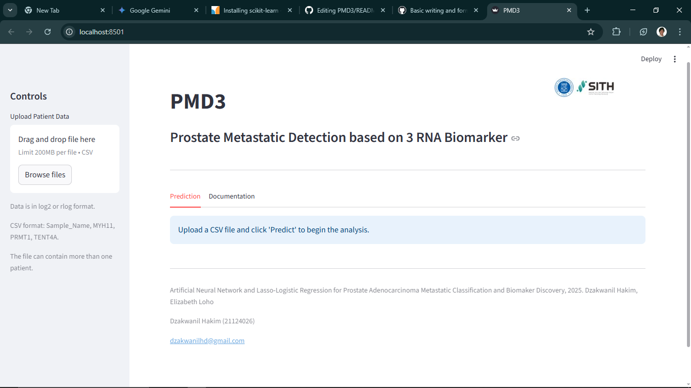
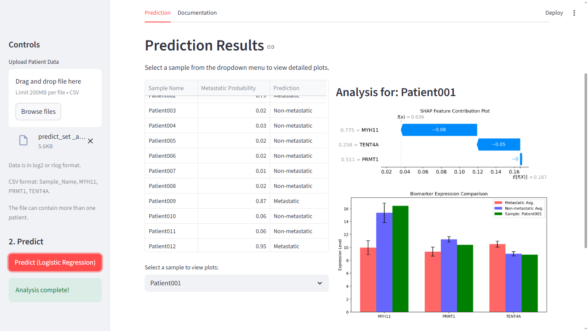
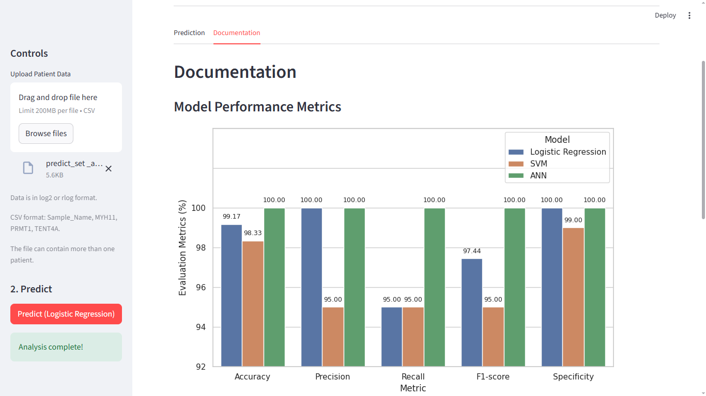

# PMD3 — Prostate Metastatic Detection with 3 RNA Biomarkers

A Streamlit web app for predicting prostate cancer metastasis status from RNA expression data, using a Lasso-Logistic Regression model and SHAP-based explainability.

> Based on research that placed **3rd at Genomics and Science Dojo 2.0** (Feb 2025), supported by the British Embassy Jakarta & UK International Development.
> https://metastatic-prostate.streamlit.app/ 
> Full research repo: [dzakwanilhakim/prostate-metastatis-ml-rna](https://github.com/dzakwanilhakim/prostate-metastatis-ml-rna)

---

## Features

- Upload a CSV of patient RNA expression values (MYH11, PRMT1, TENT4A)
- Predicts metastatic vs. non-metastatic status with probability score
- Per-sample SHAP waterfall plots for model explainability
- Biomarker expression bar chart comparing sample vs. group averages
- Model performance and SHAP beeswarm plot in the Documentation tab

---

## Screenshots

| Start | Prediction | Documentation |
|---|---|---|
|  |  |  |

---

## Installation

**Requirements:** Python >= 3.10

```bash
git clone https://github.com/dzakwanilhakim/PMD3.git
cd PMD3
pip install -r requirements.txt
```

---

## Usage

```bash
streamlit run main.py
```

The app will open in your default browser. Upload a CSV file from `data_example/` to try a simulation.

**CSV format:**

```
Sample_Name,MYH11,PRMT1,TENT4A
SAMPLE_01,12.3,10.1,9.8
```

Values should be in **log2 or rlog normalized** format.

---

## Repository Structure

```
PMD3/
├── main.py                  # Streamlit app entry point
├── backend.py               # Prediction & SHAP logic (Prediction class)
├── requirements.txt
├── models/
│   ├── best_lr.pkl          # Trained Lasso-Logistic Regression model
│   ├── scaler_3.pkl         # Fitted MinMaxScaler
│   └── X_background.pkl     # SHAP background dataset
├── data_example/            # Sample CSV files for testing
├── assets/                  # Logo and result figures
└── docs/                    # App screenshots
```

---

## Citation

> Hakim D., Loho E. (2025). *Lasso-Logistic Regression and Artificial Neural Network for Prostate Adenocarcinoma Metastatic Classification and Biomarker Discovery.* Genomics and Science Dojo 2.0.

**Contact:** Dzakwanil Hakim — dzakwanilhd@gmail.com
